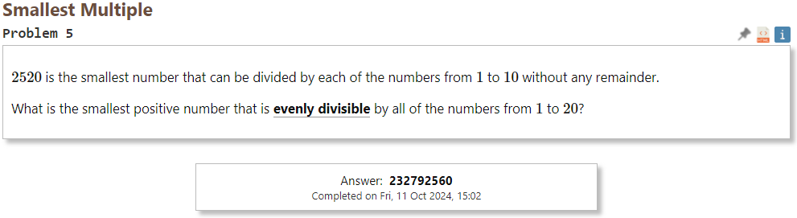
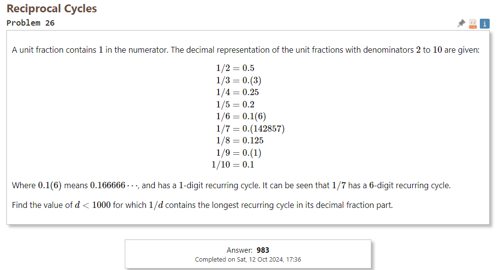

<i>МИНИСТЕРСТВО НАУКИ И ВЫСШЕГО ОБРАЗОВАНИЯ РОССИЙСКОЙ ФЕДЕРАЦИИ  
ФЕДЕРАЛЬНОЕ ГОСУДАРСТВЕННОЕ АВТОНОМНОЕ ОБРАЗОВАТЕЛЬНОЕ  
УЧРЕЖДЕНИЕ ВЫСШЕГО ОБРАЗОВАНИЯ  
«Национальный исследовательский университет ИТМО»  
</i>
**ФАКУЛЬТЕТ ПРОГРАММНОЙ ИНЖЕНЕРИИ И КОМПЬЮТЕРНОЙ ТЕХНИКИ**  

<br>

**ЛАБОРАТОРНАЯ РАБОТА №1**  
по дисциплине  
«Функциональное программирование»  

Вариант № 5,26

<br><br>

**Выполнил:**  
Студент группы P3319  
Билобрам Денис

<br>

## Описание проблем
5\) Smallest Multiple


26\) Reciprocal Cycles


# Ключевые элементы реализации

### 5\) <b>Smallest Multiple</b> <br>

1. монолитная реализации с использованием
* хвостовой рекурсии:
```
def smallest_multiple_tail_recursive(n \\ 1) do
    if Enum.all?(1..20, fn x -> rem(n, x) == 0 end) do
      n
    else
      smallest_multiple_tail_recursive(n+1);
    end
end
```
Перебор чисел начиная с n = 1 до числа, которое делится без остатка на все числа от 1 до 20.

* рекурсии:
```
def smallest_multiple_recursive(n \\ 1) do
    if Enum.all?(1..20, fn x -> rem(n, x) == 0 end) do
      n
    else
      next_value = smallest_multiple_recursive(n + 1)
      next_value
    end
end
```
То же самое, только теперь результат функции связывается с next_value а затем функция возвращает next_value, из-за этого рекурсия не свернется в хвостовую.

2. модульная реализация:
```
# нок
def lcm(a, b) do
    div(a * b, gcd(a, b))
end

# нод
defp gcd(a, 0), do: a
defp gcd(a, b), do: gcd(b, rem(a, b))

def generate_sequence() do
    1..20
end

def find_smallest_multiple() do
    generate_sequence()
        |> Enum.reduce(&lcm/2)
end
```
Здесь lcm/2 находит наименьшее общее кратное для двух чисел, для этого используется функция gdc/2, которая находит наибольшой общий делитель двух чисел. Далее в find_smallest_multiple используя свойство lcm(a, b, c) = lcm(lcm(a, b), c) находится НОК всех чисел от 1 до 20. Генерируется последовательность а затем через оператор конвеера передается в первый аргумент функции Enum.reduce/2, во второй аргумент оператором захвата передается функция lcm/2, первый элемент становится аккумулятором и функция lcm/2 последовательно применятся к аккумулятору и следующему элементу последовательности.

3. генерация последовательности при помощи отображения (map):
```
def find_smallest_multiple() do
    generate_sequence()
    |> Enum.map_reduce(1, fn x, acc ->
        new_acc = lcm(acc, x)
        {new_acc, new_acc}
       end)
    |> elem(1)
end
```
То же самое, только тут используется map_reduce и генерируется новая последовательность, элемент с индексом i которой будет являться НОК всех чисел от 1 до i+1. Возвращает map_reduce кортеж, первый элемент которого новая последовательность, а второй элемент это финальное значение аккумулятора.

4. В Elixir нет синтаксиса для циклов.

5. Hабота с бесконечными списками:

```
def generate_sequence() do
    Stream.iterate(1, fn x -> x + 1 end)
      |> Stream.take(20)
  end

  def find_smallest_multiple() do
    generate_sequence()
    |> Enum.reduce(&lcm/2)
  end
```
То же самое, только для генерации последовательность 1..20 я использую бесконечный список и генерирую первые 20 элементов.

### 26\) <b>Smallest Multiple</b> <br>
1. монолитная реализации с использованием
* хвостовой рекурсии:
```
defp find_cycle(q, remainder, seen_remainders, position) do
    case Map.get(seen_remainders, remainder) do
        nil ->
            new_seen_remainders = Map.put(seen_remainders, remainder, position)
            new_remainder = rem(remainder * 10, q)
            find_cycle(q, new_remainder, new_seen_remainders, position + 1)
        initial_position ->
            position - initial_position
    end
end

def reciprocal_cycles_tail_recursive(q \\ 2, max_period \\ 0, max_q \\ 2) do
    if q < 1000 do
        period = find_recurring_cycle_length(q)

        if period > max_period do
        reciprocal_cycles_tail_recursive(q + 1, period, q)
        else
        reciprocal_cycles_tail_recursive(q + 1, max_period, max_q)
        end
    else
        {max_q, max_period}
    end
end
```
Основной цикл просто перебирает все числа от 2 до 999 в поисках дроби с наибольшим количеством цифр в периоде. Подсчет кол-ва цифр в периоде числа основывается на запоминании остатка при делении числа столбиком, как только встречается остаток который уже был, цикл закончился.

* рекурсии:
То же самое, просто значенеи функции связывается и только затем возвращается.

2. модульная реализация:
```
def generate_sequence() do
    2..999
end

def calculate_cycles() do
    generate_sequence()
        |> Enum.map(&({&1, find_recurring_cycle_length(&1)}))
end

def find_max_cycle() do
    calculate_cycles()
    |> Enum.reduce({0, 0}, fn {q, length}, {max_q, max_length} ->
        if length > max_length do
            {q, length}
        else
            {max_q, max_length}
        end
    end)
end
```
Принцип поиска периода с наибольшим кол-вом цифр остается прежним, однако для основного цикла вместо рекурсии используется Enum.reduce, проходясь по всем {max_q, max_length} и возвращая кортеж с максимальным max_length.

3. генерация последовательности при помощи отображения (map):
```
def calculate_cycles() do
    generate_sequence()
        |> Enum.map(&({&1, find_recurring_cycle_length(&1)}))
end
```
В предыдщем пунтке уже используется Enum.map, здесь простая последовательность чисел 2..999 преобразуется в последовательность кортежей {число, длина_периода}

4. В Elixir нет синтаксиса для циклов.

5. Hабота с бесконечными списками:

```
def generate_sequence() do
    Stream.iterate(2, fn x -> x + 1 end)
      |> Stream.take(999)
end
```
То же самое, только для генерации последовательность 2..999 я использую бесконечный список и генерирую первые 999 элементов.

# Выводы

Я использовал язык программирования Elixir и применял различные техники, характерные для функционального программирования. Одним из ключевых приемов была работа с рекурсией: я использовал как хвостовую рекурсию для оптимизации производительности, так и обычную рекурсию для более наглядного сохранения промежуточных значений. Также я активно применял функции высшего порядка, такие как Enum.reduce и Enum.map, что позволило сократить количество кода и сделать его более читаемым. Для работы с последовательностями я использовал бесконечные потоки через Stream.iterate, что дало возможность генерировать элементы по мере необходимости, улучшая производительность и снижая потребление памяти